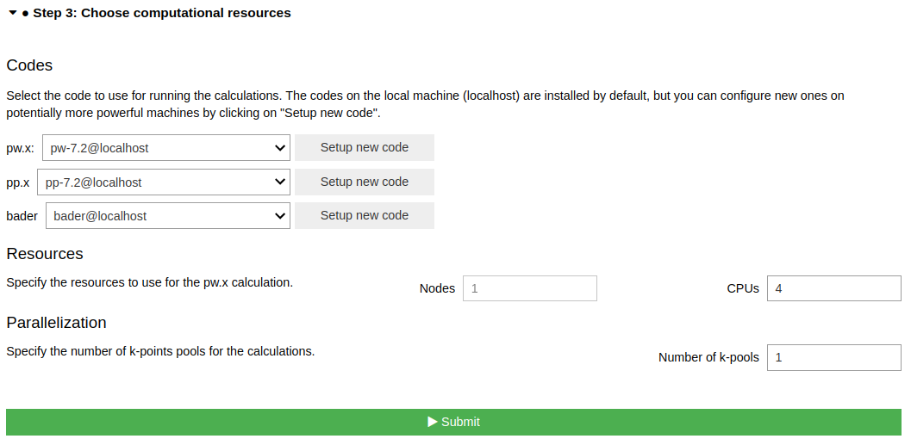

======================================
How to calculate Bader charge in QEApp
======================================

Overview
========
This tutorial will guide you through the process of setting up and running Bader charge in QEApp calculation for LiCoO\ :sub:`2`.

Steps
=====

To start, go ahead and :doc:`launch </installation/launch>` the app, then follow the steps below.

Step 1 Select a structure
--------------------------------
For this tutorial task, please use the `From Examples` tab, and select the LiCoO\ :sub:`2` structure.

Click the `Confirm` button to proceed.

Step 2 Configure workflow
--------------------------------

In the **Structure optimization** section, select ``Structure as is``.

In the Step 2.1, select ``Bader charge analysis``

In the Step 2.2, **Basic Settings** tab, set the following parameters:

- Set **Protocol** to ``Fast``

Click the **Confirm** button to proceed.

Step 3 Choose computational resources
---------------------------------------
In this small system, we can use the default `localhost` computer to run the calculation.

.. tip::
   For large system, we need the high-performance computer to run Bader charge calculation.
   Please read the relevant :doc:`How-To </howto/setup_computer_code>` section to setup code on a remote machine.

Set the number of CPUs/nodde to 4.

Then, click the **Submit** button.

Step 4 Check the status and results
-----------------------------------------
The job may take 2~4 minutes to finish.

While the calculation is running, you can monitor its status as shown in the :ref:`basic tutorial <basic_status>`.
When the job is finished, you can view result spectra in the `Bader Charge` tab.

.. tip::

   If the `Bader Charge` tab is now shown when the jobs is finished.
   Click the ``QeAppWorkChain<pk>`` item on top of the nodetree to refresh the step.

Here is the result of the calculation. It includes:
- the Bader charge data for the structure
- the Structure viewer

Click on the row above to highlight the specific atom whose Bader charge is being calculated.

Congratulations, you have finished this tutorial!

Questions
=========

If you have any questions, please, do not hesitate to ask on the AiiDA discourse forum: https://aiida.discourse.group/.
